# Development Workflows

## Overview

This README describes the development workflows for IES projects. The workflows are designed to automate issue creation, tracking, and PR management. The system uses GitHub Actions to manage the development process.

### Branch Strategy

The workflows support the following core branch structure:

- `main` - Production branch containing released versions
- `qa/*` - Integration branch for development submitted for QA
   - Example: `qa/abc` contains the EPC related changes ready for QA review
   - PR target `rc/*` branch
- `rc/*` - Release candidate branch for final release approval
   - Example: `rc/def` contains the EPC related changes for customer review
   - PR target `main` branch

## Working Branches

- `dev/*` - Proposed changes to classes and relations
   - Example: `dev/epc` contains proposed changes around the concept of an Energy Performance Certificate (EPC)
   - PR target `qa/epc` branch
- `bugfix/*` - Non-critical bug fixes
   - Example: `bugfix/epc` contains a fix for a non-critical bug in the EPC related concepts and relations
   - PR target `qa/epc` branch
- `hotfix/*` - Critical production fixes (merges to `main`)
   - Example: `hotfix/epc` contains a critical fix for the EPC related concepts and relations
   - PR target `main` branch



## Workflows

There are three core development workflows:

1. Setup repo labels, `setup-labels.yml` (manual trigger)
2. Create a new `develop`, `bugfix`, or `hotfix` issue using `create-issue.yml` (manual trigger)
3. PR checks on issues, branches, and PRs, `pr-checks.yml` (event-triggered)

### 1. Repository Labels (`setup-labels.yml`)

Manages the repository's labels used by the development workflows.

**Usage:**

1. Go to Actions tab
2. Select "Setup Repository Labels"
3. Click "Run workflow"

### 1. Create a new `develop`, `bugfix`, or `hotfix` issue (`create-issue.yml`)

A manually triggered workflow for creating new issues.

**Local repo usage:**

Run the workflow using the GitHub CLI `gh`:

```bash
gh workflow run create-issue.yml
# ... fill in the input fields
git fetch origin
git branch
# displays a list of branches, including the new development branch
```

Switch to the new develop branch:

```bash
# Replace `abc` with the actual branch name
git switch dev/[abc]
```

**GitHub Web Usage:**

1. Go to [GitHub.com Actions][github-actions] tab
2. Select "Create Issue"
3. Click "Run workflow"
4. Fill out the form:
   - Title
   - Description
   - Type (develop, bugfix, or hotfix)
   - Review
   - Priority level
   - Size estimate
   - Acceptance criteria

### 2. Automated PR Workflow (`pr-checks.yml`)

Automatically processes issues and pull requests (triggered by GH workflow events)

**Triggers:**

- Issues: opened, labeled, reopened, closed
- Pull requests: opened, closed, reopened, edited

**Functionality:**

- Manages labels based on content
- Validates PR target branches
- Links PRs to issues
- Updates status labels

## Labels

The system uses the following label categories:

### Standard Labels
- `bug` - Something isn't working
- `documentation` - General documentation tasks
- `duplicate` - This issue or pull request already exists
- `enhancement` - New feature or request
- `good first issue` - Good for newcomers
- `help wanted` - Extra attention is needed
- `invalid` - This doesn't seem right
- `question` - Further information is requested
- `wontfix` - This will not be worked on
- `hotfix` - Urgent production fix

### Priority Labels
- `priority:high` - Urgent issues
- `priority:medium` - Important but not urgent
- `priority:low` - Nice to have

### Size Labels
- `size:xs` - Extra small (few hours)
- `size:s` - Small (1-2 days)
- `size:m` - Medium (3-5 days)
- `size:l` - Large (1-2 weeks)
- `size:xl` - Extra large (2+ weeks)

### Process Labels
- `wip` - Work in progress
- `tech-review-needed` - Needs technical review
- `ready-for-review` - Ready for final review
- `has-issue` - PR linked to an issue
- `needs-attention` - Pull request needs attention
- `production-release` - Pull Request is a production release
- `release-candidate` - Pull Request is a release candidate

### Documentation Labels
- `docs-new` - New documentation needed
- `docs-update` - Updates to existing docs
- `docs-fix` - Documentation fixes
- `docs-clarity` - Improvements to documentation clarity

## Development Flow

1. **Creating a new issue (`develop`, `bugfix`, or `hotfix`):**

- Use the issue template `create-issue.yml` or workflow `create-issue.yml`
- Provide required information
- Issue is automatically labeled and added to the repo project

2. **Starting Development:**

- Create `dev/*` or `bugfix/*` branch from `qa/*`
- Branch name should follow `dev/*` or `bugfix/*` pattern
- Reference issue in commit messages

3. **Pull Request:**

*Note: to support early feedback during development, create a draft PR at the start of development.*

- Create PR targeting the `qa/*` branch
- Link to original issue using "Closes #[issue number]"
- A draft PR will give QA reviewers access to WIP changes early for informal reviews

4. **Review Process:**

- Automated checks for correct target branch
- Required reviews from QA team
- Labels updated automatically based on status

## Required Secrets and Variables

The workflows require the following secrets and variables to be configured:

- `IES_ONTOLOGIES_PAT` - (secret) GitHub Personal Access Token with repo scope
- `PROJECT_ID` - (variable) ID of the GitHub Project board

## Customization

To modify the workflow behavior:

1. **Issue Template:**
   - Edit `.github/ISSUE_TEMPLATE/create-issue.yml`
   - Update fields, validations, or descriptions

2. **Workflows:**

   - Edit `create-issue.yml` for issue creation behaviour
   - Edit `pr-checks.yml` for development issue and PR checks
   - Edit `setup-labels.yml` to change the repo lable set

Run the updated workflow to apply changes.

## Troubleshooting

Common issues and solutions:

1. **Wrong Target Branch:**

   - Check branch naming follows conventions
   - Ensure PR targets correct branch
   - Look for "needs-attention" label and comments

2. **Missing Labels:**

   - Run the label setup workflow
   - Check for error messages in workflow logs

3. **Project Board Issues:**

   - Verify the GitHug.com PROJECT_ID variable is correct
   - Ensure the GitHib.com Organization PAT has required permissions

[github-actions]: https://github.com/IES-Org/ies-ontology-template/actions
