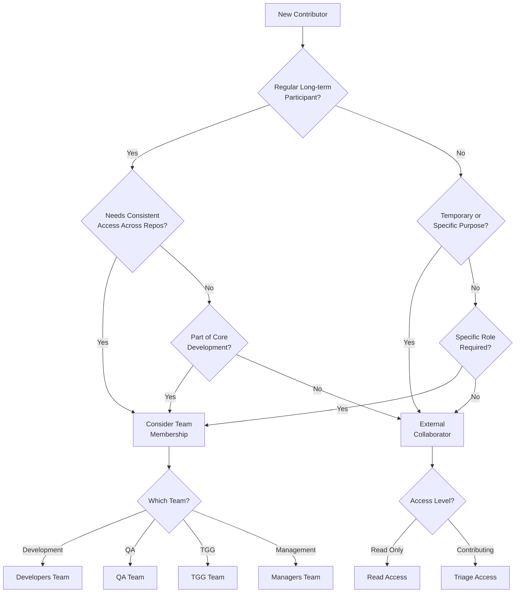

# Contributors

This document outlines the structure, roles, and membership of the IES Ontology project team. We value all contributions from our community members.

## Project Teams

### IES Developers Team
Team members who extend and enhance IES ontologies with the following permissions:
- Repository write access for development branches
- Issue and PR creation/management
- Project board updates
- GitHub Actions execution (read)

### IES QA Reviewers Team
Team members who review and approve pull requests with the following permissions:
- Repository write access for QA branches
- Issue and PR management
- PR approval rights for QA targets
- Project board view access
- GitHub Actions execution (read)

### TGG (Technical Governance Group) Reviewers Team
Team members who review and approve release candidates with the following permissions:
- Repository write access for release candidate branches
- Issue and PR management
- PR approval rights for release candidates
- Project board view access
- GitHub Actions execution (read)

### Managers Team
Team members who oversee development and manage the organization with the following permissions:
- Repository write access for main branch
- Issue and PR management
- PR approval rights for main branch
- Project board administration

## Current Team Members

### IES Developers
<!-- Add team members here -->
- [Name](GitHub Profile URL) - Role/Specialty

### IES QA Reviewers
<!-- Add team members here -->
- [Name](GitHub Profile URL) - Role/Specialty

### TGG Reviewers
<!-- Add team members here -->
- [Name](GitHub Profile URL) - Role/Specialty

### Managers
<!-- Add team members here -->
- [Name](GitHub Profile URL) - Role/Specialty

## External Contributors

We welcome contributions from external collaborators. See our [CONTRIBUTING.md](CONTRIBUTING.md) guide for details on how to get involved.

### External Collaborators
<!-- Add significant external contributors here -->
- [Name](GitHub Profile URL) - Organization/Contribution Area

## Hall of Fame

This section recognizes past contributors who have made significant impacts to the project:
<!-- Add past significant contributors here -->
- [Name](GitHub Profile URL) - Contribution Period - Key Contributions

## Collaboration Models

### Team Membership vs External Collaboration

We use the following decision tree to determine whether a new contributor should join a team or participate as an external collaborator:

### Team Membership Criteria

Team membership is considered for contributors who meet one or more of these criteria:
- Regular, long-term participant in the project
- Requires consistent access across multiple repositories
- Has specific workflow responsibilities
- Participates in team planning
- Needs role-based permissions
- Part of core development activities
- Requires organizational communication access

### External Collaboration Model

External collaborator status is appropriate for contributors who:
- Are temporary contributors
- Need access to specific repositories only
- Serve as external reviewers (infrequent basis)
- Provide one-off contributions
- Represent partner organizations
- Are testing or evaluating ontologies
- Don't require team-wide access

### External Collaborator Access Levels
- Read: View and clone repositories
- Triage: Manage issues and pull requests
- Write: Access to non-protected branches (e.g., `dev/*` or `bugfix/*`)

### Onboarding Process

1. Initial Request
   - Document access requirements
   - Specify expected duration
   - Identify needed repositories
   - Define required access level

2. Review and Approval
   - Validate requirements
   - Check compliance
   - Approve access level

3. Access Provisioning
   - Send GitHub invitation
   - Configure permissions
   - Set access duration
   - Document access details

4. Orientation
   - Share contribution guidelines
   - Provide documentation
   - Explain workflows
   - Set expectations

## Contact

For questions about team structure or joining the project:
- Open an issue in the repository
- Contact current team members listed above
- Email: [Project Email Address]

---

## License

This document is part of the IES Ontology project and is subject to the project's license terms.