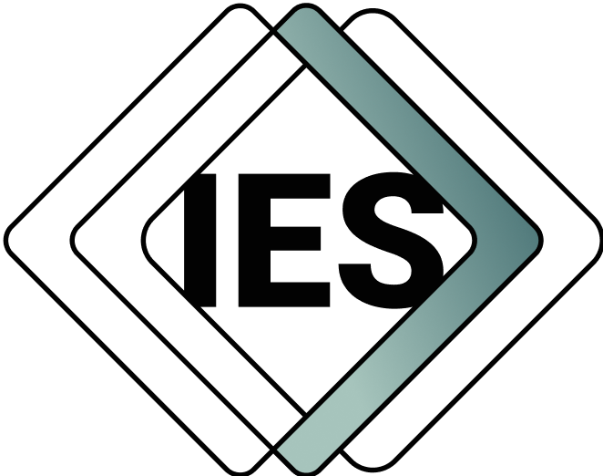

# IES [INSERT-NAME-HERE] Ontology

**Repository:** `IES [INSERT-NAME-HERE] Ontology`
**Description:** `This repository contains the development artifacts for the IES [INSERT-NAME-HERE] ontology. It follows the standard IES ontology development repository structure and incorporates shared IES tools and GitHub workflows.`  
**Repository Status:** `Private – NDTP InnerSource`  

---

## Overview

This repository is part of the **National Digital Twin Programme (NDTP)**. It supports the development of secure, modular, and standards-based ontologies for internal use across NDTP projects.

> **This repository is private and governed by the NDTP InnerSource Licence – Version 1.0.**  
> It is intended solely for collaboration among NDTP teams and authorised suppliers.  
> It is **not open source** and must not be disclosed, redistributed, or published externally.

This repository contains the development artifacts for the IES [INSERT-NAME-HERE] ontology. It follows the standard IES ontology development repository structure and incorporates shared IES tools and GitHub workflows.

--- 

## Contributing
Please see [Contributing Guide][docs-contrib] for guidelines on how to contribute to this ontology project.

## Licensing

See [LICENSE.md][license] for full details.

> ⚠️ This repository is **not open source**.  
> Redistribution, disclosure, or publication of any part of this repository is prohibited without the **explicit, written approval** of the NDTP Management Team.

All intellectual property rights are held by the **Department for Business and Trade (UK)** as the governing entity for the National Digital Twin Programme (NDTP).

### Attribution
When using this ontology, you must include the attribution: [© Crown Copyright 2020-2024 (Department for Business and Trade)][copyright].

### Third Party Components
This project includes third party software and tools under different licenses. See individual dependency documentation for details.

## Acknowledgements  
This repository has benefited from collaboration with various organisations. For a list of acknowledgments, see [ACKNOWLEDGEMENTS.md][ack].  

## Support and Contact  
For questions or support, check our Issues or contact the NDTP team on ndtp@businessandtrade.gov.uk.

**Maintained by the National Digital Twin Programme (NDTP).**

## Changelog
See [CHANGELOG][CHANGELOG] for a list of changes in each release.

## Version
Current version information is maintained in the [VERSION][VERSION] file.

## Vulnerability Disclosure

GOV.UK Pay aims to stay secure for everyone. If you are a security researcher and have discovered a security vulnerability in this repository, we appreciate your help in disclosing it to us in a responsible manner. Please refer to our [vulnerability disclosure policy][vul] and our [security.txt][sec] file for details.

© Crown Copyright 2025. This work has been developed by the National Digital Twin Programme and is legally attributed to the Department for Business and Trade (UK) as the governing entity.

[ack]: ACKNOWLEDGEMENTS.md
[build-readme]: build/README.md
[build-tools-readme]: ies_tools/src/build/README.md
[CHANGELOG]: CHANGELOG.md
[copyright]: https://www.nationalarchives.gov.uk/information-management/re-using-public-sector-information/uk-government-licensing-framework/crown-copyright/
[docs-contrib]: docs/CONTRIBUTING.md
[gh-readme]: .github/github-README.md
[license]: LICENSE.md
[sec]: https://vdp.cabinetoffice.gov.uk/.well-known/security.txt
[VERSION]: VERSION
[vul]: https://www.gov.uk/help/report-vulnerability