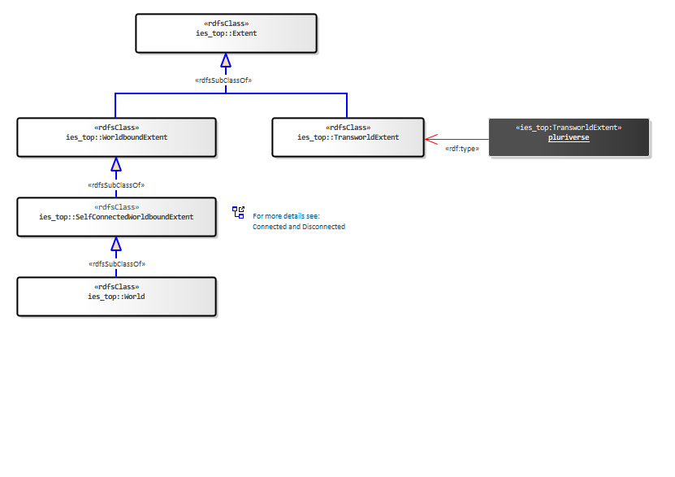
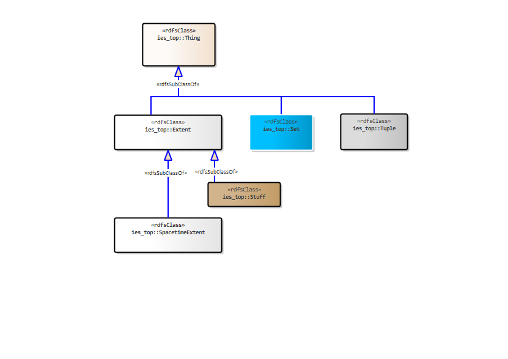
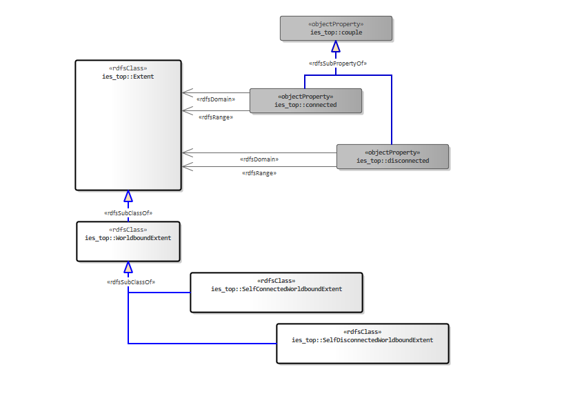
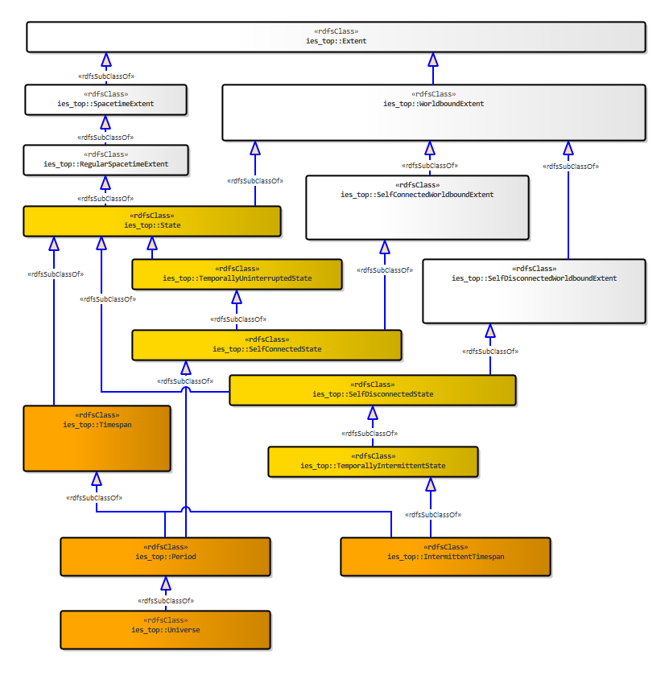

[back to readme](README.md)

Crown Copyright (c) 2026
#  Top

# version: 0.2.0 (RC2)
## Contents
* Introduction Diagrams
    * [Top Overview](#0f81418a-23a7-4c91-8e35-5864ef60b4d8)
    * [Grounding Relations](#9b8f8584-8708-4253-b4b5-5c8680b8880c)
    * [The Pluriverse](#bc0c5822-5211-48eb-a9ab-650574156206)
    * [Identity](#3726076a-1ad7-448e-92a4-1e0e2ee43bd3)
    * [Spacetime](#79a9be26-1ad4-4fa8-946b-e3c95123b551)
    * [Instances and Sets](#7f1f8754-b7ac-453d-b478-307b8c2022a8)
    * [Parts and Wholes](#083953be-b4f9-4bbd-bc03-35f1a092609d)
    * [Tuples](#2bc55488-1f01-42e8-bda0-0d8264279944)
    * [Relationships](#33ad9371-11c1-4df5-9edc-a2310eaf6cd9)
    * [Connected and Disconnected](#72bead0a-b76c-479d-8e19-cbefcafd8b2e)
    * [Uninterrupted and Intermittent](#611cae4f-a088-40af-8705-dac276894424)
    * [Overlap and Disjoint](#99360175-5578-4956-b9f7-a690495ddb5e)
* [All Resources](#ies_top)
## Top Overview

### IES elements in this diagram:

* [Extent](#7f27c6ff-b0db-4267-8513-cd77b1dfc36e)
* [groundingRelation](#45345e32-79b0-4d24-8424-2531acdf691a)
* [Set](#059b5013-017b-496f-b104-ea82b69b8792)
* [Thing](#27c6bcf1-9ffe-4172-ac2c-e32653b43014)
* [Tuple](#b65c4468-4e79-4857-8a01-1da50501e692)

At the top of top you have:
<ul>
	<li><b>Thing </b>- Is either an extent, set, tuple or grounding relation.</li>
	<li><b>Extent</b>- A Thing that is a part of the pluriverse - and so has an extent.</li>
	<li><b>Set </b>- A Thing that is an unordered collection of other Things, sometimes referred to as a class or kind.</li>
	<li><b>Tuple</b>  - A Thing that is an (ordered) sequence of Things. Each position in the sequence is pointed to by a tuplePlace.</li>
	<li><b>groundingRelation </b>- A thing which is one of the four basic relationships between two Things.</li>
</ul>

The equivalent top level of the BORO(TM) Foundational Ontology, has relations here that are of a higher-order than the ones provided in RDF/S (e.g. sub-super-pluralities). At this level we are not talking about sub and super sets/classes but sub and super pluralities. However, in the implementation of ies-top we have avoided adding such relations and instead stick with using subClassOf and subPropertyOf which are ubiquitous among the RDF community and its tools.

## Grounding Relations

### IES elements in this diagram:

* [groundingRelation](#45345e32-79b0-4d24-8424-2531acdf691a)
* [partWhole](#ced45081-fc65-43bf-a953-25232ef7820b)
* [powertype](#82f50d01-425f-400f-b147-6228c9019fde)
* [subSuperRelation](#d6ec5416-51c4-457f-9eae-4482a118d9b3)
* [tuplePlace](#e0c16b56-3271-444b-8f2f-01756c2dde60)

Grounding relations are derived from the four basic constructors outlined in the <a href="https://borosolutions.net/core-constructional-ontology"><u>Core Constructional Ontology</u></a>. They are:
<ul>
	<li>type (Element-Set)</li>
	<li>subSuperRelation (Subset-Superset)</li>
	<li>partWhole (Part-Whole)</li>
	<li>tuplePlace (Tuple Place)</li>
</ul>
Note: regarding the above, the first name is that used in ies-top, the name in brackets is used in the Core Constructional Ontology. In addition: colloquially in IES we sometimes refer to <i>type</i> as <i>Member-Set</i>.

The concept of pluralities is found at a higher order than the concepts in RDF/S. As a result, we have had to define RDF/S resources in the context of our top-level. Here you will see that rdf:type, rdfs:subClassOf and rdfs:subPropertyOf are themselves ies_top:groundingRelations.

## The Pluriverse

### IES elements in this diagram:

* [Extent](#7f27c6ff-b0db-4267-8513-cd77b1dfc36e)
* [SelfConnectedWorldboundExtent](#883d875a-d9ae-453f-b998-d3c93a1a9d07)
* [TransworldExtent](#84c0dee2-4a34-440a-add2-abd327ce6c52)
* [World](#80bb3547-b04e-4ba1-a18e-e350e4c6bb4a)
* [WorldboundExtent](#2c69b5c1-9b2f-48ab-aebe-300ce76ba0a0)

In IES, we commit to the <i>Pluriverse</i>, which provides the foundation for talk about possibilities (and Intensional Properties). We use an approach based on David Lewis' interpretation of <i>Possible Worlds</i> (which we refer to as <i>Worlds</i>) to make clear distinctions between extents that can be <i>transworld</i> (part of more than one world) and the ones we do most of our work with, those that are <i>worldbound </i>(part of one and only one world). This commitment also accommodates worlds that are radically dissimilar to our own, including worlds governed by different laws of nature, topological structures, and other fundamental features.

## Identity

### IES elements in this diagram:

* [Extent](#7f27c6ff-b0db-4267-8513-cd77b1dfc36e)
* [Set](#059b5013-017b-496f-b104-ea82b69b8792)
* [SpacetimeExtent](#77bb5948-c5bf-4cc2-b6dc-b7ffe413adf5)
* [Stuff](#0f8a7a2e-896c-4b09-afde-f63807bdc767)
* [Thing](#27c6bcf1-9ffe-4172-ac2c-e32653b43014)
* [Tuple](#b65c4468-4e79-4857-8a01-1da50501e692)

In extensional ontologies, like IES, the identity of an individual is determined by its extension or extent:

<b><i>If two individuals have the same parts, they are the same individual.</i></b>

This provides the (mereological) foundation for the spatiotemporal criterion of identity, first introduced into IES at Version 4.

<b><i>If two individuals occupy the same spacetime, they are the same individual.</i></b>

IES-Top makes these identity criteria explicit within its hierarchy through the introduction of <i>Extent</i>, representing any part of a pluriverse, and its subclass <i>SpacetimeExtent</i>, representing any part of a spacetime world (see <i>Spacetime</i>). The extensional approach to identity also applies to the other two forms of Thing: Sets and Tuples. 

The criterion of identity for Set is:

<b><i>If two sets have the same members, they are the same set. </i></b>

And for Tuple:

<b><i>If two tuples have the same sequence of members, they are the same tuple. </i></b>

## Spacetime

### IES elements in this diagram:

* [Extent](#7f27c6ff-b0db-4267-8513-cd77b1dfc36e)
* [Period](#d77a3301-53bb-4820-a86a-f7c6a0d4c9a4)
* [RegularSpacetimeExtent](#dcb3f671-0fa3-4de6-b037-a011c432a087)
* [SelfConnectedWorldboundExtent](#883d875a-d9ae-453f-b998-d3c93a1a9d07)
* [SpacetimeExtent](#77bb5948-c5bf-4cc2-b6dc-b7ffe413adf5)
* [State](#885fc001-7738-47ab-8870-30d004a57180)
* [Timespan](#b9900e87-e85c-4378-8afe-d3a5ef0168a0)
* [TransworldExtent](#84c0dee2-4a34-440a-add2-abd327ce6c52)
* [Universe](#6dc85ae1-ca5e-4fd1-8b67-afd244d1d01d)
* [World](#80bb3547-b04e-4ba1-a18e-e350e4c6bb4a)
* [WorldboundExtent](#2c69b5c1-9b2f-48ab-aebe-300ce76ba0a0)

<i>SpacetimeExtent</i> denotes any <i>Extent</i> that is part of a spacetime world, which is a world with a <i>before-after</i> relation. This is intentionally general and does not presuppose any particular geometrical, topological, or differential structure of the spacetime world.

Nevertheless, most work in physics, including General Relativity, represents spacetime as a smooth four-dimensional manifold. Since the principal applications of IES are situated within such spacetimes, IES-Top explicitly distinguishes between <i>SpacetimeExtent</i> in general and <i>RegularSpacetimeExtent</i>, whose underlying spacetime satisfies these regularity conditions.
&nbsp;
<ul>
	<li><b>SpacetimeExtent </b>- a spatiotemporal extent aka. a four-dimensional extent.</li>
</ul>
<ul>
	<li><b>RegularSpacetimeExtent </b>- a spacetime extent which is part of a world which is a smooth four-dimensional manifold (a universe).</li>
	<li><b>Universe</b> - a regular spacetime world i.e., one with a smooth four-dimensional manifold.</li>
</ul>
<ul>
	<li><b>State</b> - a regular spacetime extent that is universe-bound i.e. part of one and only one universe.</li>
	<li><b>Timespan</b> - a state (i.e. universe-bound regular spacetime extent) that is a temporal part of a universe. Note: a universe is an improper temporal part of itself - and so a maximal timespan.</li>
	<li><b>Period</b> - a self-connected and therefore uninterrupted timespan.</li>
</ul>

## Instances and Sets

### IES elements in this diagram:

* [Extent](#7f27c6ff-b0db-4267-8513-cd77b1dfc36e)
* [groundingRelation](#45345e32-79b0-4d24-8424-2531acdf691a)
* [powertype](#82f50d01-425f-400f-b147-6228c9019fde)
* [RegularSpacetimeExtent](#dcb3f671-0fa3-4de6-b037-a011c432a087)
* [Set](#059b5013-017b-496f-b104-ea82b69b8792)
* [SetOfExtents](#805df273-fd65-4ed5-becb-621f5b16042c)
* [SetOfRegularSpacetimeExtents](#0c4a5ca9-a706-4653-ab55-69d2fcab0d23)
* [SetOfSetOfExtents](#decf0e9c-7789-4946-a685-0fbaacd25181)
* [SetOfSetOfRegularSpacetimeExtents](#33a6e9f9-54b5-4045-8733-ce821d972c6f)
* [SetOfSetOfSpacetimeExtents](#68fee518-3d9a-430f-8255-1a1a16784af9)
* [SetOfSetOfStates](#44a34647-ea2f-4635-8dd4-9e48008a85af)
* [SetOfSpacetimeExtents](#315712c7-2da2-4ba5-9c79-3ce42d1a640d)
* [SetOfStates](#e25c3b00-4ca3-40f4-9443-15c9dc4ee972)
* [SpacetimeExtent](#77bb5948-c5bf-4cc2-b6dc-b7ffe413adf5)
* [State](#885fc001-7738-47ab-8870-30d004a57180)
* [Thing](#27c6bcf1-9ffe-4172-ac2c-e32653b43014)

To support the placement of elements into sets, we adopt the ubiquitously used <i>rdf:type </i>relation. This follows the same approach as IES4. <i>powertype</i> also carries over from IES4.

## Parts and Wholes

### IES elements in this diagram:

* [Extent](#7f27c6ff-b0db-4267-8513-cd77b1dfc36e)
* [groundingRelation](#45345e32-79b0-4d24-8424-2531acdf691a)
* [isAFinishOf](#291c902a-0cac-467e-9c3a-ad8ee537cb3d)
* [isAStartOf](#c939a967-d8a7-4a4b-bac3-ca1631a54b82)
* [isImproperPartOf](#a46e9e64-6238-42d3-96ab-e0ab6c532636)
* [isPartOf](#b51571e4-8ac5-4387-bb47-ab110e15f586)
* [isTemporalPartOf](#91245399-d5d7-4ad7-a8da-c0db2f9e4332)
* [partWhole](#ced45081-fc65-43bf-a953-25232ef7820b)
* [RegularSpacetimeExtent](#dcb3f671-0fa3-4de6-b037-a011c432a087)
* [SpacetimeExtent](#77bb5948-c5bf-4cc2-b6dc-b7ffe413adf5)
* [State](#885fc001-7738-47ab-8870-30d004a57180)

IES-Top provides mereological relations at two levels of generality. The base relation, <i>partWhole</i>, places one extent as part of another and holds between extents of any kind - whether they are bound to a single world or span across two worlds. The relations most users will utilize - <b><i>isPartOf</i></b> and its sub-relations - are narrower: they hold between regular spacetime extents, both bound to a single universe (universe-mates) - that is, between states.
&nbsp;
<ul>
	<li><b>partWhole</b> - a grounding relation placing one extent as part of another (the whole).</li>
	<li><b>isPartOf</b> - a partWhole relation between two states, where both states are bound to the same universe (universe-mates).</li>
	<li><b>isTemporalPartOf</b> - an isPartOf that asserts the spatial extent of the (whole) state is co-extensive with the spatial extent of the (part) state for a particular period of time.</li>
	<li><b>isAStartOf</b> - an isTemporalPartOf that places a state as one (but not always the only) temporal part at the beginning of another.</li>
	<li><b>isAFinishOf</b> - an isTemporalPartOf that places a state as one (but not always the only) temporal part at the conclusion of another.</li>
	<li><b>isImproperPartOf</b> - an isPartOf between two states that are the same i.e., the part is identical to the whole.</li>
</ul>
Note: this final mereological relation provides the foundations for OWL's <i>sameAs</i> relation between individuals.

## Tuples

### IES elements in this diagram:

* [couple](#85feafd9-50a0-42ea-9cc7-8dc7b055f47b)
* [FourPlaceTuple](#9a10f900-2011-45d3-9201-85b9e5a2784a)
* [Thing](#27c6bcf1-9ffe-4172-ac2c-e32653b43014)
* [ThreePlaceTuple](#462ab7c2-3866-4085-b0f4-7e14a989cc5c)
* [Tuple](#b65c4468-4e79-4857-8a01-1da50501e692)
* [tuplePlace](#e0c16b56-3271-444b-8f2f-01756c2dde60)
* [tuplePlace_1](#c9dc8b44-ee16-4d29-9e5c-0326218c5914)
* [tuplePlace_2](#b97dd954-1164-43b7-9de8-d4e350a8c2e6)
* [tuplePlace_3](#e719f16e-ec6b-47bb-848d-16544e31316c)
* [tuplePlace_4](#8bd2e8ce-a8c4-41af-bc35-832a68d6b53c)

A  tuple is a sequence of two or more things. Each part of a tuple is identified by a <i>tuplePlace.</i>
E.g. for the tuples that are members of <i>Father-Son Tuples, </i>you recover the father-son relations by knowing that<i> </i>the first tuple place is for the father and the second for the son:
&lt;father_1, son_1&gt;
Another example is the tuples that are members of the <i>Between Tuples</i>:
&lt;endpoint_1, midpoint_x, endpoint_2&gt;
For IES4, we avoided higher arity Tuples as the vast majority of what users want to articulate are two-placed tuples aka. Couples. Couples were realised using simple RDF properties and this will be the same in ies-top. However, in ies-top we want to have a solid and complete top-level and that means having tuples that are beyond 2 places. As a result, we will support 2-placed tuples using the user-friendly RDF properties and beyond-2 placed tuples using the RDF N-ary approach.
ies-top provides in its base serialization tuples of up to four places. If users need tuples with more than four places, they should define them within the ies-top namespace, following the established naming conventions shown here for the Tuple classes and the tuple place properties. For example, a seven-place tuple shall have the URI <i>ies_top:SevenPlaceTuple</i>, while the additional tuple places needed shall be defined as <i>ies_top:tuplePlace_5</i>, <i>ies_top:tuplePlace_6</i>, and <i>ies_top:tuplePlace_7</i>.

## Relationships

### IES elements in this diagram:

* [after](#1e663e8c-8b98-410d-a373-ce8e2dadaa1f)
* [couple](#85feafd9-50a0-42ea-9cc7-8dc7b055f47b)
* [Extent](#7f27c6ff-b0db-4267-8513-cd77b1dfc36e)
* [Period](#d77a3301-53bb-4820-a86a-f7c6a0d4c9a4)
* [RegularSpacetimeExtent](#dcb3f671-0fa3-4de6-b037-a011c432a087)
* [relationship](#5cc94004-05d7-45ec-a5c8-56cffe8a3a39)
* [relationshipBetweenStates](#4f36c24c-39a3-472d-94c3-b2bbd48f951f)
* [relationshipBetweenUniverseMates](#030e8b68-77eb-4013-bd03-33198a229c83)
* [SpacetimeExtent](#77bb5948-c5bf-4cc2-b6dc-b7ffe413adf5)
* [State](#885fc001-7738-47ab-8870-30d004a57180)
* [Thing](#27c6bcf1-9ffe-4172-ac2c-e32653b43014)
* [Timespan](#b9900e87-e85c-4378-8afe-d3a5ef0168a0)
* [Universe](#6dc85ae1-ca5e-4fd1-8b67-afd244d1d01d)

A relation between two things in IES, is a two-placed tuple aka. a couple. Couples are implemented as simple RDF properties.

As with the mereological relations, IES-Top provides couple relations at several levels of generality, drawing the same world-bound distinctions: <b><i>relationship</i></b> is a couple between any two regular spacetime extents - whether or not they are universe-bound. <b><i>relationshipBetweenStates</i></b> narrows this to universe-bound extents (states), and <b><i>relationshipBetweenUniverseMates</i></b> narrows it further to states belonging to the same universe (universe-mates).

## Connected and Disconnected

### IES elements in this diagram:

* [connected](#033a4291-2451-4d73-9f39-82c1cc057e6f)
* [couple](#85feafd9-50a0-42ea-9cc7-8dc7b055f47b)
* [disconnected](#ff5a8319-5d38-478d-a982-b4f90b41f97a)
* [Extent](#7f27c6ff-b0db-4267-8513-cd77b1dfc36e)
* [SelfConnectedWorldboundExtent](#883d875a-d9ae-453f-b998-d3c93a1a9d07)
* [SelfDisconnectedWorldboundExtent](#18d96dd0-f197-43ff-9a5f-c33cca3efb5d)
* [WorldboundExtent](#2c69b5c1-9b2f-48ab-aebe-300ce76ba0a0)

IES-Top provides a standard mereotopology answer to the question of gaps: <i>connected</i> and <i>disconnected</i>.

Two extents are <i>connected</i> if they are in contact - meeting with no gap between them - and <i>disconnected</i> if a gap separates them.

Connection is symmetric and is not the same as overlap (See <i>Overlap and Disjoint</i>). Extents that overlap are connected, but so are ones that merely abut, like two bricks side by side. Because connection tells us when two things touch, it also lets us ask whether a 4D extent is all one piece or is instead made up of separate chunks. 

In fact, a 4D extent can be "in pieces" in two different ways: it can be spread out across space at any one time e.g., a fleet of ships, scattered but sailing together; or it can be broken across time e.g., a trumpet that is assembled, taken apart, and reassembled. Standard mereotopology uses the term <i>self-connected</i>, if an individual can't be split into two separate parts, and <i>self-disconnected</i>, if it can.

## Uninterrupted and Intermittent

### IES elements in this diagram:

* [Extent](#7f27c6ff-b0db-4267-8513-cd77b1dfc36e)
* [IntermittentTimespan](#ed41858d-a919-4e57-9c60-e2333556c826)
* [Period](#d77a3301-53bb-4820-a86a-f7c6a0d4c9a4)
* [RegularSpacetimeExtent](#dcb3f671-0fa3-4de6-b037-a011c432a087)
* [SelfConnectedState](#40eb16bc-a0c9-4d17-bce2-e94c8d4249f1)
* [SelfConnectedWorldboundExtent](#883d875a-d9ae-453f-b998-d3c93a1a9d07)
* [SelfDisconnectedState](#0c7b7816-2469-49a3-bb1b-215591f1bf60)
* [SelfDisconnectedWorldboundExtent](#18d96dd0-f197-43ff-9a5f-c33cca3efb5d)
* [SpacetimeExtent](#77bb5948-c5bf-4cc2-b6dc-b7ffe413adf5)
* [State](#885fc001-7738-47ab-8870-30d004a57180)
* [TemporallyIntermittentState](#54795bb4-0a44-4837-ad45-2e51ede3dd2f)
* [TemporallyUninterruptedState](#01fbe830-dc8b-4c9d-8cda-d8d2bfd22dfe)
* [Timespan](#b9900e87-e85c-4378-8afe-d3a5ef0168a0)
* [Universe](#6dc85ae1-ca5e-4fd1-8b67-afd244d1d01d)
* [WorldboundExtent](#2c69b5c1-9b2f-48ab-aebe-300ce76ba0a0)

With the mereotopological foundations for talking about gaps and self-connectedness, we can provide an explanation for states that are temporally uninterrupted (no gaps in their temporal extent) and those that are gappy.
&nbsp;
<ul>
	<li><b>TemporallyUninterruptedState</b> - a state with no gap in time. Whichever way it is cut into an earlier part and a later part, the two always meet i.e., there is no temporal moment between them where it does not exist.</li>
	<li><b>SelfConnectedState</b> - a temporally uninterrupted state that, as well as having no gap in time, has no gap in space. Whichever way it is cut, the two always touch; it is one connected whole.</li>
	<li><b>SelfDisconnectedState</b> - a state that is a single whole that can be cut into two parts that do not touch; separated by a gap. It is made up of separate chunks rather than being one continuous extent.</li>
	<li><b>TemporallyIntermittentState</b> - a self-disconnected state with a gap, or gaps, in time. It can be cut into an earlier part and a later part that do not meet.</li>
	<li><b>Timespan</b> - a state (i.e. universe-bound) that is a temporal part of a universe. Note: a universe is an improper temporal part of itself - and so a maximal period.</li>
	<li><b>Period - </b>a self-connected and therefore uninterrupted timespan.</li>
	<li><b>IntermittentTimespan</b> - an interrupted timespan which is also a fusion of timespans.</li>
</ul>

The practical use of a <i>TemporallyIntermittentState </i>is that it lets us treat something that occurs sometimes or repeatedly as a single state, without having to call out the individual occurrences. Consider saying a car is usually parked in a particular location. Rather than enumerate every state of the car being there, we identify one TemporallyIntermittentState (the fusion of all those temporally separated states) and assert that it is part of the location. That one assertion covers every occurrence. And since a TemporallyIntermittentState is a regular spacetime extent, it can be bounded like any other e.g. the car was usually parked there between one time and another.

## Overlap and Disjoint

### IES elements in this diagram:

* [couple](#85feafd9-50a0-42ea-9cc7-8dc7b055f47b)
* [Extent](#7f27c6ff-b0db-4267-8513-cd77b1dfc36e)
* [inDisjoint](#45765024-5f7b-4f82-a87b-99b174b3c4ce)
* [inOverlap](#f7685c02-3d81-4649-b965-f78ebccf4e9b)
* [intersectionOf](#b79f1b38-5b0e-4647-a661-cc8836ba68d0)
* [SetOfDisjointExtents](#2733c396-a001-42fb-945f-b4f26e120b33)
* [SetOfExtents](#805df273-fd65-4ed5-becb-621f5b16042c)
* [SetOfOverlappingExtents](#af81b43d-1f08-4ab8-a4a2-521a71183550)

There are times when two or more extents have shared parts and expressing that shared part (the intersection) is useful e.g., coverage area of two mobile phone cellular masts.

In other cases, it is equally important to call out two or more extents that have no shared parts i.e. are disjoint. For example, disjoint paths taken by two aircraft. Note that disjoint extents can be connected (see <i>Connected and Disconnected</i>).

## ies_top

### after
A precedence relation between universe-mates where one lies ahead of the other in time: every part of the later one has some part of the earlier one behind it, every part of the earlier one has some part of the later one ahead of it, and nothing runs back the other way.

### connected
A couple relation between two extents that are in contact, meeting with no gap between them. This couple relation is symmetric.

### couple
A two placed tuple. Realized in RDF as an rdf:property. 

### disconnected
A couple relation between two extents that are not in contact, i.e., they are separated by a gap. This couple relation is symmetric.

### Extent
A Thing that is a part of the pluriverse - and so has an extent.

### FourPlaceTuple
A Tuple with four places.

### groundingRelation
A Thing which is one of the four basic relationships between two Things. Realized in RDF as a rdf:property.

### inDisjoint
A type relation that asserts membership to a set of disjoint extents.

### inOverlap
A type relation that asserts membership to a set of overlapping extents.

### IntermittentTimespan
An interrupted timespan which is also a fusion of timespans.

### intersectionOf
A couple between an Extent and a SetOfOverlappingExtents, where the Extent is the intersection of the overlapping extents. Note, there is no Intersection subClassOf of Extent because in some way, any extent can be considered an intersection of others.

### isAFinishOf
An isTemporalPartOf that places a state as one (but not always the only) temporal part at the conclusion of another.

### isAStartOf
An isTemporalPartOf that places a state as one (but not always the only) temporal part at the beginning of another.

### isImproperPartOf
An isPartOf between two states that are the same i.e. the part is identical to the whole.

### isPartOf
A partWhole relation between two states, where both states are bound to the same universe (universe-mates).

### isTemporalPartOf
An isPartOf that asserts the spatial extent of the (whole) state is co-extensive with the spatial extent of the (part) state for a particular period of time.

### partWhole
A grounding relation placing one extent as part of another (the whole).

### Period
A self-connected and therefore uninterrupted timespan.

### powertype
An rdf:type relation that asserts one set is the powerset of the other (see Cantors theorem).

### RegularSpacetimeExtent
A spacetime extent which is part of a world which is a smooth four-dimensional manifold (a universe).

### relationship
A couple between any two regular spacetime extents.

### relationshipBetweenStates
A relationship between any two states, where a state is a universe-bound regular spacetime extent.

### relationshipBetweenUniverseMates
A  relationship where those states are part of the same universe as one another.

### SelfConnectedState
A temporally uninterrupted state that, as well as having no gap in time, has no gap in space. Whichever way it is cut, the two always touch; it is one connected whole.

### SelfConnectedWorldboundExtent
A worldbound extent where there is always a path that connects any two parts. Put another way: whichever way it is cut, the two parts always touch. They will never be separated.

### SelfDisconnectedState
A state that is a single whole that can be cut into two parts that do not touch; separated by a gap. It is made up of separate chunks rather than being one continuous extent.

### SelfDisconnectedWorldboundExtent
A worldbound extent that can be cut into two parts that do not touch i.e., they are separated by a gap. It is made up of separate chunks.

### Set
A Thing that is an unordered collection of other Things, sometimes referred to as a class or kind.

### SetOfDisjointExtents
A set of extents which are disjoint from one another i.e. they do not overlap.

### SetOfExtents
The powertype of Extent. An instance of this is a set that contains extents.

### SetOfOverlappingExtents
A set of extents that overlap either partially or completely with one another.

### SetOfRegularSpacetimeExtents
The powertype of RegularSpacetimeExtent. An instance of this is a set that contains regular spacetime extents.

### SetOfSetOfExtents
The powertype of SetOfExtents. An instance of this is a set that contains sets of extents.

### SetOfSetOfRegularSpacetimeExtents
The powertype of SetOfRegularSpacetimeExtents. An instance of this is a set that contains sets of regular spacetime extents.

### SetOfSetOfSpacetimeExtents
The powertype of SetOfSpacetimeExtents. An instance of this is a set that contains sets of spacetime extents.

### SetOfSetOfStates
The powertype of SetOfStates. An instance of this is a set that contains sets of states.

### SetOfSpacetimeExtents
The powertype of SpacetimeExtent. An instance of this is a set that contains spacetime extents.

### SetOfStates
The powertype of State. An instance of this is a set that contains states.

### SpacetimeExtent
A spatiotemporal extent aka. a four-dimensional extent.

### State
A regular spacetime extent that is universe-bound i.e. part of one and only one universe.

### Stuff
An extent that is highly dissective or generally uncountable. Any division of it yields the same type of extent e.g. if you cut sand in half, you still have sand. As well as sand, other examples include water, gas and coffee.

### subSuperRelation
A grounding relation which is either a sub-super relation between Sets (rdfs:subClassOf) or Tuples, including Couples (rdfs:subPropertyOf).

### TemporallyIntermittentState
A self-disconnected state with a gap, or gaps, in time. It can be cut into an earlier part and a later part that do not meet.

### TemporallyUninterruptedState
A state with no gap in time. Whichever way it is cut into an earlier part and a later part, the two always meet i.e., there is no temporal moment between them where it does not exist.

### Thing
Either an Extent, Set, or Tuple.

### ThreePlaceTuple
A Tuple with three places.

### Timespan
A state (i.e. universe-bound regular spacetime extent) that is a temporal part of a universe. Note: a universe is an improper temporal part of itself - and so a maximal timespan.

### TransworldExtent
An extent that has parts in more than one world. Note: all transworld extents are self-disconnected.

### Tuple
A Thing that is an (ordered) sequence of Things. Each position in the sequence identified by a <i>tuplePlace.</i>

### tuplePlace
A grounding relation which identifies a part of a Tuple.

### tuplePlace_1
The first place in a Tuple.

### tuplePlace_2
The second place in a Tuple.

### tuplePlace_3
The third place in a Tuple.

### tuplePlace_4
The fourth place in a Tuple.

### Universe
A regular spacetime world i.e., one with a smooth four-dimensional manifold.

### World
A maximal self-connected worldbound extent that includes everything in a world, irrespective of any indexing, such as whether it is present now, in the past, or in the future.

### WorldboundExtent
An extent that is bound to one world i.e. part of one and only one world.

### pluriverse
An instance of TransworldExtent which is the maximal sum of all extents and so is the sum of all worlds (and their parts). Put another way, this has everything in every world as a part. This includes worlds made up of spacetime as well as worlds with non-spatiotemporal structures.

### rdfs:subClassOf

### rdfs:subPropertyOf

### rdf:type

