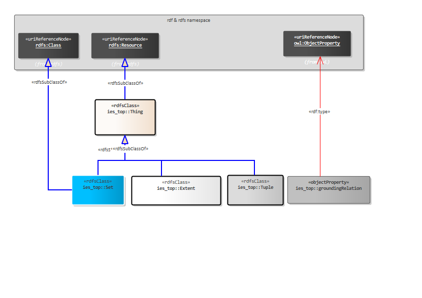
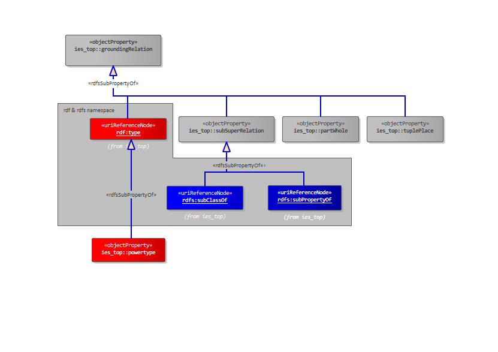
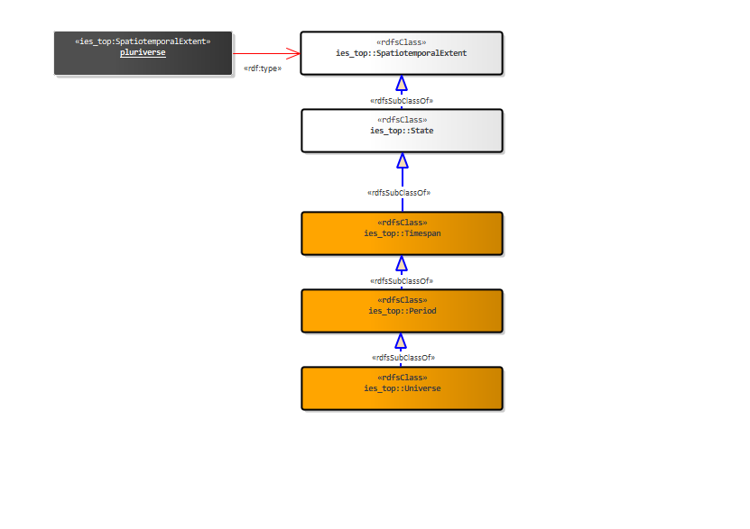
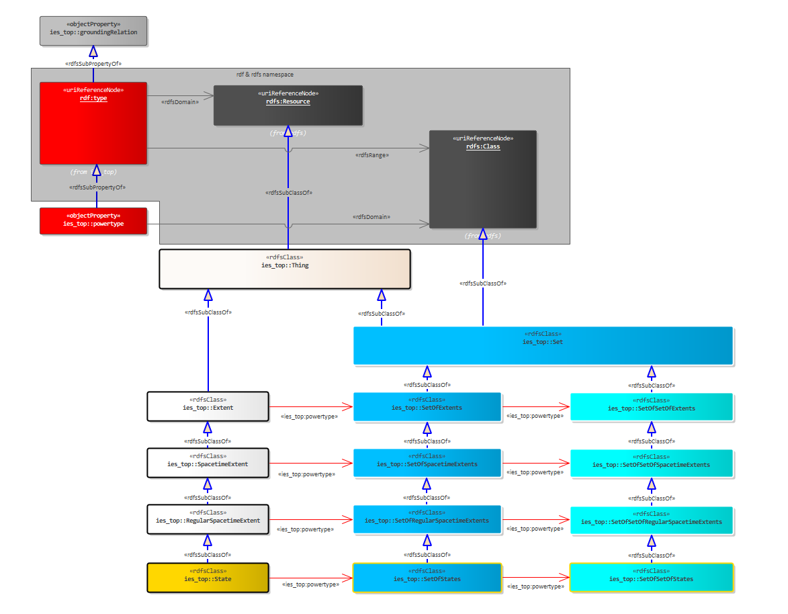
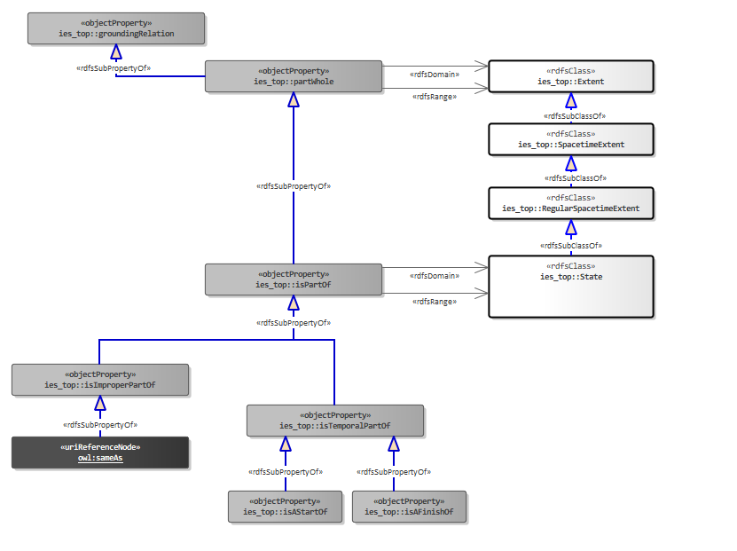
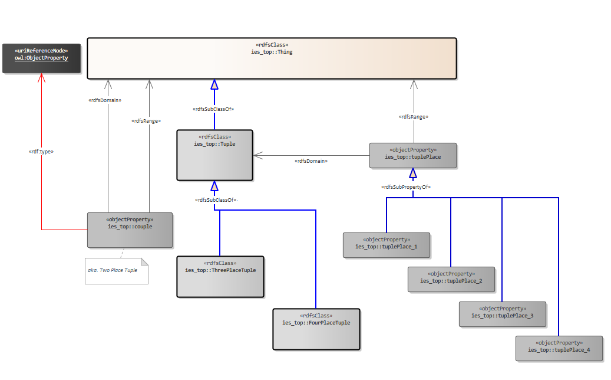
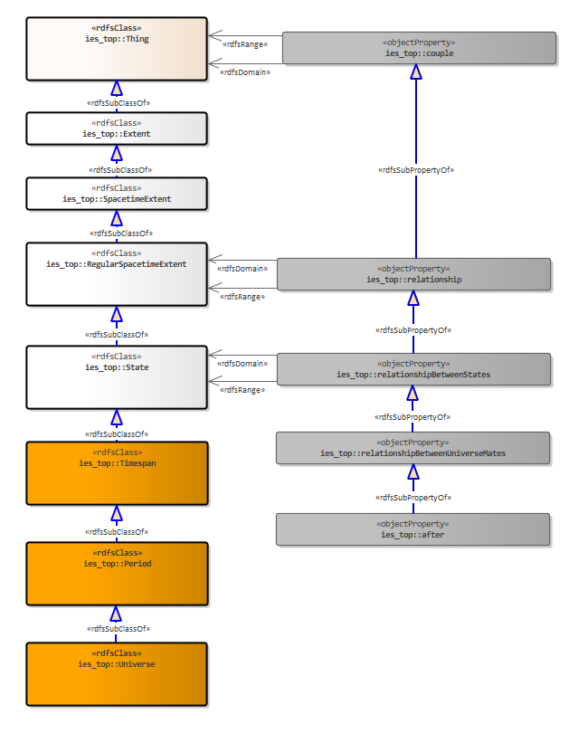
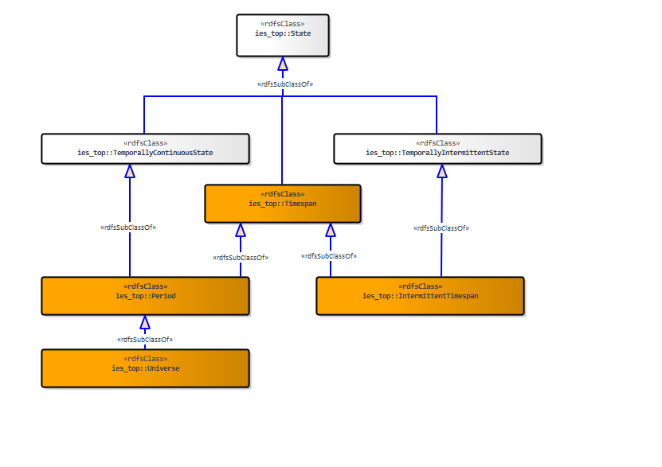
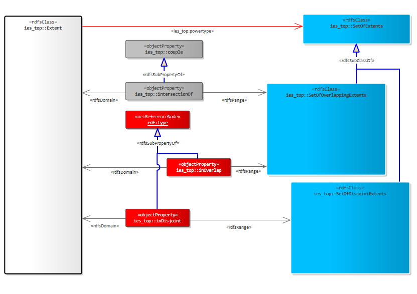

[back to readme](README.md)

Crown Copyright (c) 2025

  

Top

# version: 0.1.0 (RC1)
## Contents
* Diagrams
    * [Top Overview](#0f81418a-23a7-4c91-8e35-5864ef60b4d8)
    * [Grounding Relations](#9b8f8584-8708-4253-b4b5-5c8680b8880c)
    * [The Pluriverse](#79a9be26-1ad4-4fa8-946b-e3c95123b551)
    * [Instances and Sets](#7f1f8754-b7ac-453d-b478-307b8c2022a8)
    * [Parts and Wholes](#083953be-b4f9-4bbd-bc03-35f1a092609d)
    * [Tuples](#2bc55488-1f01-42e8-bda0-0d8264279944)
    * [Relationships](#33ad9371-11c1-4df5-9edc-a2310eaf6cd9)
    * [Continuous and Intermittent](#a03d8fc4-5d76-455a-b60e-564bcf235d24)
    * [Overlap and Disjoint](#99360175-5578-4956-b9f7-a690495ddb5e)
* [All Resources](#ies_top)
## Top Overview

### IES elements in this diagram:

* [Set](#059b5013-017b-496f-b104-ea82b69b8792)
* [Thing](#27c6bcf1-9ffe-4172-ac2c-e32653b43014)
* [groundingRelation](#45345e32-79b0-4d24-8424-2531acdf691a)
* [Tuple](#b65c4468-4e79-4857-8a01-1da50501e692)
* [SpatiotemporalExtent](#dcb3f671-0fa3-4de6-b037-a011c432a087)

At the top of top you have:
<ul>
	<li><b>Thing </b>- Is either a spatiotemporal extent, set, tuple or grounding relation.</li>
	<li><b>SpatiotemporalElement </b>- A Thing that is a part of the pluriverse - and so has a 4D extent.</li>
	<li><b>Set </b>- A Thing that is an unordered collection of other Things, sometimes referred to as a class or kind.</li>
	<li><b>Tuple</b>  - A Thing that is an (ordered) sequence of Things. Each position in the sequence is pointed to by a tuplePlace.</li>
	<li><b>groundingRelation </b>- A thing which is one of the four basic relationships between two Things.</li>
</ul>

The equivalent top level of the BORO(TM) Foundational Ontology, has relations here that are of a higher-order than the ones provided in RDF/S (e.g. sub-super-pluralities). At this level we are not talking about sub and super sets/classes but sub and super pluralities. However, in the implementation of ies-top we have avoided adding such relations and instead stuck with using subClassOf and subPropertyOf which are ubiquitous among the RDF community and its tools.

## Grounding Relations

### IES elements in this diagram:

* [groundingRelation](#45345e32-79b0-4d24-8424-2531acdf691a)
* [powertype](#82f50d01-425f-400f-b147-6228c9019fde)
* [subSuperRelation](#d6ec5416-51c4-457f-9eae-4482a118d9b3)
* [tuplePlace](#e0c16b56-3271-444b-8f2f-01756c2dde60)
* [partWhole](#ced45081-fc65-43bf-a953-25232ef7820b)

Grounding relations are derived from the four basic constructors outlined in the <a href="https://borosolutions.net/core-constructional-ontology"><u>Core Constructional Ontology</u></a>. They are:
<ul>
	<li>type (Element-Set)</li>
	<li>subSuperRelation (Subset-Superset)</li>
	<li>partWhole (Part-Whole)</li>
	<li>tuplePlace (Tuple Place)</li>
</ul>

Note: In the Core Constructional Ontology, the term 'element' is used for the role in the Element-Set relationship. In ies-top we refer to this as 'member' i.e. Member-Set.
The concept of pluralities is found at a higher order than the concepts in RDF/S. As a result, we have had to define RDF/S resources in the context of our top-level. Here you will see that rdf:type, rdfs:subClassOf and rdfs:subPropertyOf are themselves ies_top:groundingRelations.

## The Pluriverse

### IES elements in this diagram:

* [Universe](#6dc85ae1-ca5e-4fd1-8b67-afd244d1d01d)
* [State](#885fc001-7738-47ab-8870-30d004a57180)
* [Period](#d77a3301-53bb-4820-a86a-f7c6a0d4c9a4)
* [SpatiotemporalExtent](#dcb3f671-0fa3-4de6-b037-a011c432a087)
* [Timespan](#b9900e87-e85c-4378-8afe-d3a5ef0168a0)

In IES, we commit to the pluriverse, which provides the grounding for talk about possibilities (using universes) we need to make clear distinctions between elements that can be trans-universe (part of more than one universe) and the ones we do most of our work with, those that are universe-bound (part of one and only one universe).
<ul>
	<li><b>pluriverse </b>- An instance of SpatiotemporalExtent which is the sum of all universes (where everything in each universe is part of that universe). Put another way, this has everything in every universe as a part.</li>
</ul>
<ul>
	<li><b>State </b>- an spatiotemporal extent that is universe-bound i.e. an spatiotemporal extent which is part of one and only one universe.</li>
</ul>
<ul>
	<li><b>Timespan</b> - a state (i.e. universe-bound spatiotemporal extent) that is a temporal part of a world. Note: a universe is an improper temporal part of itself - and so a maximal timespan.</li>
</ul>
<ul>
	<li><b>Period</b> - a connected and uninterrupted timespan.</li>
</ul>
<ul>
	<li><b>Universe</b> - a maximal spatiotemporal connected extent that includes everything in a universe, irrespective of any indexing, such as whether it is present now, in the past, or in the future.</li>
</ul>

## Instances and Sets

### IES elements in this diagram:

* [Set](#059b5013-017b-496f-b104-ea82b69b8792)
* [Thing](#27c6bcf1-9ffe-4172-ac2c-e32653b43014)
* [groundingRelation](#45345e32-79b0-4d24-8424-2531acdf691a)
* [powertype](#82f50d01-425f-400f-b147-6228c9019fde)
* [SpatiotemporalExtent](#dcb3f671-0fa3-4de6-b037-a011c432a087)
* [SetOfSpatiotemporalExtents](#0c4a5ca9-a706-4653-ab55-69d2fcab0d23)
* [SetOfSetOfSpatiotemporalExtents](#33a6e9f9-54b5-4045-8733-ce821d972c6f)

To realize the need to be able to put elements into sets we use the ubiquitously used rdf:type. This is the same approach as in IES4. powertype also carries over from IES4.

## Parts and Wholes

### IES elements in this diagram:

* [Thing](#27c6bcf1-9ffe-4172-ac2c-e32653b43014)
* [groundingRelation](#45345e32-79b0-4d24-8424-2531acdf691a)
* [State](#885fc001-7738-47ab-8870-30d004a57180)
* [isPartOf](#b51571e4-8ac5-4387-bb47-ab110e15f586)
* [SpatiotemporalExtent](#dcb3f671-0fa3-4de6-b037-a011c432a087)
* [isTemporalPartOf](#91245399-d5d7-4ad7-a8da-c0db2f9e4332)
* [partWhole](#ced45081-fc65-43bf-a953-25232ef7820b)
* [isAStartOf](#c939a967-d8a7-4a4b-bac3-ca1631a54b82)
* [isAFinishOf](#291c902a-0cac-467e-9c3a-ad8ee537cb3d)
* [isImproperPartOf](#a46e9e64-6238-42d3-96ab-e0ab6c532636)

For the mereological relations, we make clear distinctions between what spatiotemporal extents are universe-bound and which are not. An additional distinction is made here for mereologies between spatiotemporal extents in the same universe (universe-mates).
<ul>
	<li><b>partWhole</b> - a grounding relation placing one spatiotemporal extent as part of another (the whole).</li>
	<li><b>isPartOf</b> - a partWhole relation between two states, where both states are bound to the same universe (universe-mates).</li>
	<li><b>isTemporalPartOf</b> - an isPartOf that asserts the spatial extent of the (whole) state is co-extensive with the spatial extent of the (part) state for a particular period of time.</li>
	<li><b>isAStartOf</b> - an isTemporalPartOf that places a state as one (but not always the only) temporal part at the beginning of another.</li>
	<li><b>isAFinishOf</b> - an isTemporalPartOf that places a state as one (but not always the only) temporal part at the conclusion of another.</li>
</ul>

## Tuples

### IES elements in this diagram:

* [Thing](#27c6bcf1-9ffe-4172-ac2c-e32653b43014)
* [ThreePlaceTuple](#462ab7c2-3866-4085-b0f4-7e14a989cc5c)
* [tuplePlace_4](#8bd2e8ce-a8c4-41af-bc35-832a68d6b53c)
* [FourPlaceTuple](#9a10f900-2011-45d3-9201-85b9e5a2784a)
* [Tuple](#b65c4468-4e79-4857-8a01-1da50501e692)
* [tuplePlace_2](#b97dd954-1164-43b7-9de8-d4e350a8c2e6)
* [tuplePlace_1](#c9dc8b44-ee16-4d29-9e5c-0326218c5914)
* [tuplePlace](#e0c16b56-3271-444b-8f2f-01756c2dde60)
* [tuplePlace_3](#e719f16e-ec6b-47bb-848d-16544e31316c)
* [couple](#85feafd9-50a0-42ea-9cc7-8dc7b055f47b)

A  tuple is a sequence of two or more things. Each part of a tuple is identified by a <i>tuplePlace.</i>
E.g. for the tuples that are members of <i>Father-Son Tuples, </i>you recover the father-son relations by knowing that<i> </i>the first tuple place is for the father and the second for the son:
&lt;father_1, son_1&gt;
Another example is the tuples that are members of the <i>Between Tuples</i>:
&lt;endpoint_1, midpoint_x, endpoint_2&gt;
For IES4, we avoided higher arity Tuples as the vast majority of what users want to articulate are two-placed tuples aka. Couples. Couples were realised using simple RDF properties and this will be the same in ies-top. However, in ies-top we want to have a solid and complete top-level and that means having tuples that are beyond 2 places. As a result, we will support 2-placed tuples using the user-friendly RDF properties and beyond-2 placed tuples using the RDF N-ary approach.
ies-top provides in its base serialization tuples of up to four places. If users need tuples with more than four places, they should define them within the ies-top namespace, following the established naming conventions shown here for the Tuple classes and the tuple place properties. For example, a seven-place tuple shall have the URI <i>ies_top:SevenPlaceTuple</i>, while the additional tuple places needed shall be defined as <i>ies_top:tuplePlace_5</i>, <i>ies_top:tuplePlace_6</i>, and <i>ies_top:tuplePlace_7</i>.

## Relationships

### IES elements in this diagram:

* [relationshipBetweenUniverseMates](#030e8b68-77eb-4013-bd03-33198a229c83)
* [entirelyAfter](#1e663e8c-8b98-410d-a373-ce8e2dadaa1f)
* [Thing](#27c6bcf1-9ffe-4172-ac2c-e32653b43014)
* [relationshipBetweenStates](#4f36c24c-39a3-472d-94c3-b2bbd48f951f)
* [relationship](#5cc94004-05d7-45ec-a5c8-56cffe8a3a39)
* [Universe](#6dc85ae1-ca5e-4fd1-8b67-afd244d1d01d)
* [State](#885fc001-7738-47ab-8870-30d004a57180)
* [Period](#d77a3301-53bb-4820-a86a-f7c6a0d4c9a4)
* [SpatiotemporalExtent](#dcb3f671-0fa3-4de6-b037-a011c432a087)
* [couple](#85feafd9-50a0-42ea-9cc7-8dc7b055f47b)
* [Timespan](#b9900e87-e85c-4378-8afe-d3a5ef0168a0)

A relation between two things in IES, is a two-placed tuple aka. a couple. Couples are implemented as simple RDF properties.
Like the mereological relations, we again make clear distinctions between the relationships of spatiotemporal extents that are universe-bound and which are not. Moreover, which relationships are between spatiotemporal extents in the same universe (universe-mates).
Most user-created relationships that are not <i>grounding relations</i> will typically be either <b>relationshipBetweenUniverseMates</b> or <b>couples</b>. <i>Couples</i> are utilized for relationships between spatiotemporal extents and sets, or between two sets.

## Continuous and Intermittent

### IES elements in this diagram:

* [State](#885fc001-7738-47ab-8870-30d004a57180)
* [TemporallyContinuousState](#01fbe830-dc8b-4c9d-8cda-d8d2bfd22dfe)
* [TemporallyIntermittentState](#54795bb4-0a44-4837-ad45-2e51ede3dd2f)
* [Period](#d77a3301-53bb-4820-a86a-f7c6a0d4c9a4)
* [Timespan](#b9900e87-e85c-4378-8afe-d3a5ef0168a0)
* [IntermittentTimespan](#ed41858d-a919-4e57-9c60-e2333556c826)
* [Universe](#6dc85ae1-ca5e-4fd1-8b67-afd244d1d01d)

There are times when we want to distinguish between states which are temporally continuous i.e., they have no temporal gaps in their extents and those which are <i>gappy </i>- the later used in cases when states <i>sometimes </i>occur or occur repeatedly. The 4D approach has an answer for this - temporally dissected states. These are like ordinary states but are not contiguous in time. We also don't have to call-out the individual occurrences, we just have to say that there are occurrences.
This is particularly useful when describing the location of something. If we want to say a vehicle is usually in a location, we don't want to have to call-out every state of it when it was in that location. We can simply identify the collection of those temporally separated states, called a TemporallyIntermittentState. If we say that the TemporallyIntermittentState of the car is in a location, we mean that all of states that make up the TemporallyIntermittentState (which we haven't explicitly called out) are part of the location.
Like other spatiotemporal extents, we can identify the start and end times - e.g. saying a car usually parked in a particular location between one time and another.

## Overlap and Disjoint

### IES elements in this diagram:

* [SpatiotemporalExtent](#dcb3f671-0fa3-4de6-b037-a011c432a087)
* [SetOfSpatiotemporalExtents](#0c4a5ca9-a706-4653-ab55-69d2fcab0d23)
* [SetOfOverlappingSpatiotemporalExtents](#af81b43d-1f08-4ab8-a4a2-521a71183550)
* [SetOfDisjointSpatiotemporalExtents](#2733c396-a001-42fb-945f-b4f26e120b33)
* [couple](#85feafd9-50a0-42ea-9cc7-8dc7b055f47b)
* [intersectionOf](#b79f1b38-5b0e-4647-a661-cc8836ba68d0)

There are times when two spatiotemporal extents have shared parts and expressing that shared part (the intersection) is useful (e.g. the borders of two countries). Other times, it is equally important to call out two spatiotemporal extents that have no shared parts i.e. are disjoint (e.g. the paths taken by two ships are disjoint).

## ies_top

### couple
A two placed tuple. Realized in RDF as a rdf:property. 

### entirelyAfter
A relationship (between universe-mates) where one ends before the other starts.

### FourPlaceTuple
A Tuple with four places.

### groundingRelation
A Thing which is one of the four basic relationships between two Things. Realized in RDF as a rdf:property.

### IntermittentTimespan
An interrupted timespan which is also a fusion of timespans.

### intersectionOf
A couple between a SetOfOverlappingSpatiotemporalExtents and an SpatiotemporalExtent which is the intersection of their overlap. Note, there is no Intersection subClassOf of SpatiotemporalExtent because in someway, any extent can be considered a intersection of others.

### isAFinishOf
An isTemporalPartOf that places a state as one (but not always the only) temporal part at the conclusion of another.

### isAStartOf
An isTemporalPartOf that places a state as one (but not always the only) temporal part at the beginning of another.

### isImproperPartOf
An isPartOf that asserts the two states are identical i.e. the part is identical to the whole.

### isPartOf
A partWhole relation between two states, where both states are bound to the same universe (universe-mates).

### isTemporalPartOf
An isPartOf that asserts the spatial extent of the (whole) state is co-extensive with the spatial extent of the (part) state for a particular period of time.

### partWhole
A grounding relation placing one element as part of another (the whole).

### Period
A connected and uninterrupted Timespan.

### powertype
An rdf:type relation that asserts one Set is the powerset of the other (see Cantor's theorem).

### relationship
A couple between any two spatiotemporal extents.

### relationshipBetweenStates
A relationship between any two states, where a state is a universe-bound element.

### relationshipBetweenUniverseMates
A relationshipBetweenStates where those states are part of the same universe as one another.

### Set
A Thing that is an unordered collection of other Things, sometimes referred to as a class or kind.

### SetOfDisjointSpatiotemporalExtents
A set of spatio-temporal extents which are disjoint from one another i.e. they do not overlap.

### SetOfOverlappingSpatiotemporalExtents
A set of spatio-temporal extents that overlap either partially or completely with one another.

### SetOfSetOfSpatiotemporalExtents
A Set that contains sets of spatio-temporal extents.

### SetOfSetOfStates

### SetOfSpatiotemporalExtents
A Set that contains spatio-temporal extents.

### SetOfStates

### SpatiotemporalExtent
A Thing that is a part of the pluriverse - and so has a 4D extent.

### State
A SpatiotemporalExtent that is universe-bound i.e. an element which is part of one and only one universe.

### Stuff
A spatiotemporal extent that is highly dissective or generally uncountable. Any division of it yields the same type of spatiotemporal extent e.g. if you cut sand in half, you still have sand. As well as sand, other examples include water, gas and coffee.

### subSuperRelation
A grounding relation which is either a sub-super relation between Sets (rdfs:subClassOf) or Tuples, including Couples (rdfs:subPropertyOf).

### TemporallyContinuousState
A state that is temporally continuous or temporally uninterrupted.

### TemporallyIntermittentState
A state that is temporally dissected - i.e. it is not continuous, but a fusion of states.

### Thing
Either a SpatiotemporalExtent, Set, or Tuple.

### ThreePlaceTuple
A Tuple with three places.

### Timespan
A State (i.e. universe-bound spatiotemporal extent) that is a temporal part of a universe. Note: a universe is an improper temporal part of itself - and so a maximal timespan.

### Tuple
A Thing that is an (ordered) sequence of Things. Each position in the sequence identified by a <i>tuplePlace.</i>

### tuplePlace
A grounding relation which identifies a part of a Tuple.

### tuplePlace_1
The first place in a Tuple.

### tuplePlace_2
The second place in a Tuple.

### tuplePlace_3
The third place in a Tuple.

### tuplePlace_4
The fourth place in a Tuple.

### Universe
A maximal spatiotemporal connected extent that includes everything in a universe, irrespective of any indexing, such as whether it is present now, in the past, or in the future. This is sometimes referred to as a world.

### pluriverse
An instance of SpatiotemporalExtent which is the sum of all universes (where everything in each universe is part of that universe). Put another way, this has everything in every universe as a part.

### rdfs:subClassOf

### rdfs:subPropertyOf

### rdf:type

