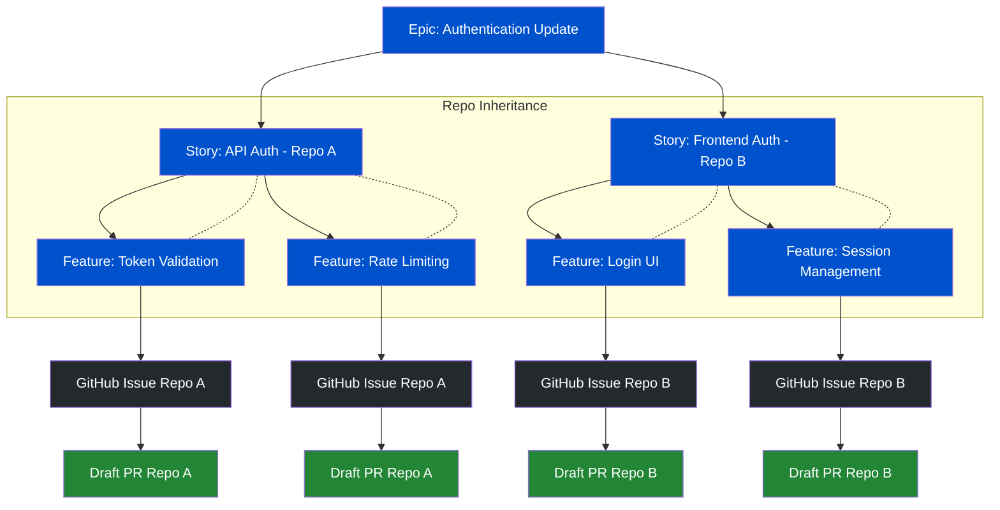
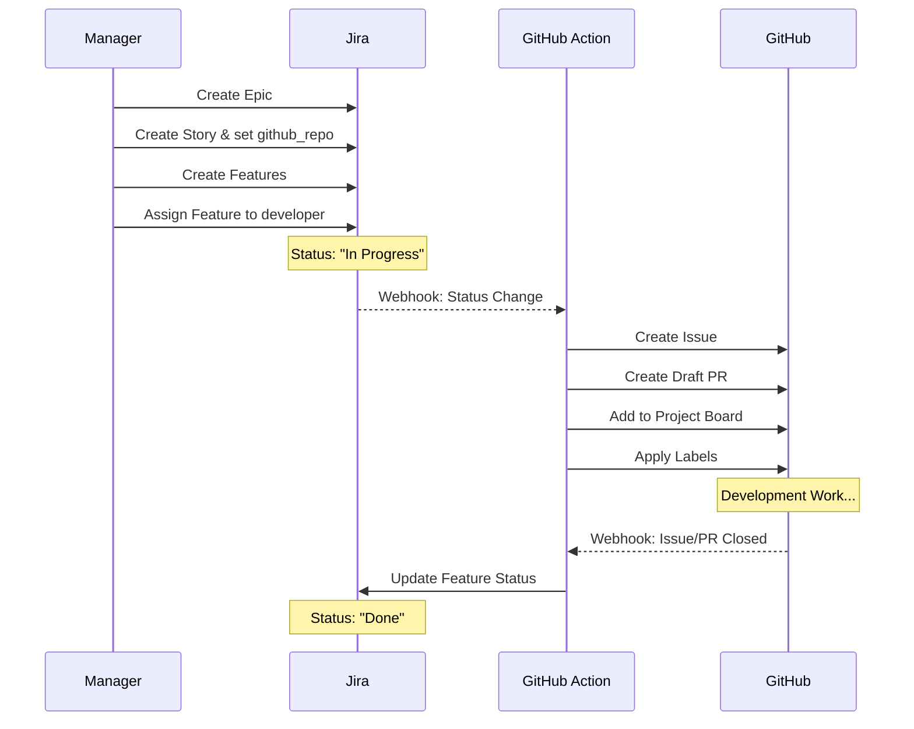
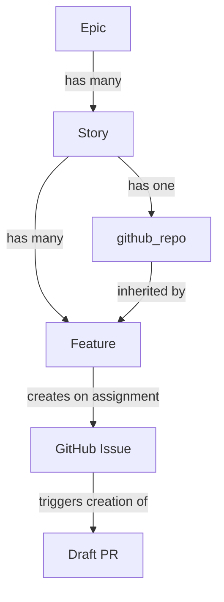

# Jira-GitHub Integration Specification

## Overview
This document outlines the integration between Jira tickets and GitHub issues/PRs across multiple repositories. The integration maintains a hierarchical structure in Jira (Epic → Story → Feature) while automatically creating and managing corresponding GitHub issues based on ticket assignment.

## System Structure

### Ticket Hierarchy


### Workflow


## Ticket Structure

### Epic
- **Purpose**: Represents a large body of work that spans multiple repositories
- **Custom Fields**: None specific to GitHub integration
- **Validation Rules**:
  - Must have at least one Story as a child
  - Cannot be directly linked to a GitHub issue

### Story
- **Purpose**: Represents all work needed for a single repository
- **Custom Fields**:
  - `github_repo` (Required)
    - Type: Single-select dropdown
    - Values: List of organization repository names
    - Validation: Must be one of the authorized repositories
    - Immutable after Feature tickets are created
- **Validation Rules**:
  - Must belong to exactly one Epic
  - Must have at least one Feature ticket as a child
  - Must have a unique repository within its parent Epic's scope

### Feature
- **Purpose**: Represents a specific unit of work that maps to a single GitHub issue
- **Custom Fields**:
  - `github_issue_url` (System-managed)
    - Type: URL
    - Format: `https://github.com/<org>/<repo>/issues/<number>`
    - Read-only after creation
  - `github_pr_url` (System-managed)
    - Type: URL
    - Format: `https://github.com/<org>/<repo>/pull/<number>`
    - Read-only after creation
- **Inherited Fields**:
  - `github_repo`: Inherited from parent Story
- **Validation Rules**:
  - Must belong to exactly one Story
  - Cannot be moved to a Story with a different `github_repo` if GitHub issue exists

## Field Dependencies



## Issue Creation Trigger
- Feature ticket assignment triggers GitHub issue creation when:
  1. Status changes to "In Progress"
  2. Assignee is set
  3. No existing GitHub issue is linked

## Synchronization Rules

### Jira → GitHub (One-time)
- Feature title → Issue title
- Feature description → Issue body
- Feature labels → Issue labels
- Assignee → Issue assignee

### GitHub → Jira (On completion)
- Issue/PR closure with success → Feature marked "Done"
- Issue/PR closure as invalid → Feature marked "Won't Do"
- No other status synchronization needed

## Implementation Notes

### Components
1. **Jira Webhook Listener**
   - Monitors Feature ticket status changes
   - Triggers GitHub Actions workflow on assignment

2. **GitHub Actions Workflows**
   - Handles issue/PR creation
   - Manages project board placement
   - Updates Jira status on completion

3. **Python Service**
   - Processes webhooks
   - Manages issue creation
   - Handles synchronization logic

### Security Requirements
- GitHub API tokens with repo scope
- Jira API tokens for status updates
- Webhook secret validation
- Rate limiting implementation

## Monitoring
- Track issue creation success rate
- Monitor completion synchronization
- Alert on webhook delivery failures
- Track average time-to-completion

## Future Enhancements
- Support for additional issue types
- Custom field mapping extensions
- Advanced GitHub project board integration
- Automated changelog generation

## Appendix A: Outline Implementation Files

**Note: these outline implementations need to be developed and customised to the extant IES repositories**

### GitHub Actions Workflow
```yaml
# .github/workflows/jira-to-github.yml
name: Create GitHub Issue from Jira
on:
  repository_dispatch:
    types: [jira_feature_assigned]

jobs:
  create-issue:
    runs-on: ubuntu-latest
    steps:
      - uses: actions/checkout@v3
      - uses: actions/setup-python@v4
        with:
          python-version: '3.10'
          cache: 'poetry'
      
      - name: Create Issue and PR
        run: poetry run jira-github-sync create-issue ${{ github.event.client_payload.jira_key }}
        env:
          GITHUB_TOKEN: ${{ secrets.GITHUB_TOKEN }}
          JIRA_API_TOKEN: ${{ secrets.JIRA_API_TOKEN }}

# .github/workflows/github-to-jira.yml
name: Update Jira on Completion
on:
  pull_request:
    types: [closed]

jobs:
  update-jira:
    runs-on: ubuntu-latest
    steps:
      - name: Update Jira Status
        run: poetry run jira-github-sync update-status ${{ github.event.pull_request.number }}
        env:
          GITHUB_TOKEN: ${{ secrets.GITHUB_TOKEN }}
          JIRA_API_TOKEN: ${{ secrets.JIRA_API_TOKEN }}
```

### Python Implementation
```python
# jira_github/webhook_handler.py
from fastapi import FastAPI, Request, HTTPException
from .sync import issue_creator, status_updater

app = FastAPI()

@app.post("/webhook/jira")
async def jira_webhook(request: Request):
    payload = await request.json()
    if payload["issue_event_type_name"] == "issue_updated":
        # Process status change
        await issue_creator.process_status_change(payload)
    return {"status": "processed"}

# jira_github/sync/issue_creator.py
from typing import Dict
import aiohttp
from ..models import JiraIssue, GitHubIssue

async def process_status_change(payload: Dict):
    """Process Jira status change and create GitHub issue if needed."""
    issue = JiraIssue.from_webhook(payload)
    if issue.should_create_github_issue():
        await create_github_issue(issue)

async def create_github_issue(jira_issue: JiraIssue):
    """Create GitHub issue and PR for Jira ticket."""
    # Your existing GitHub management code here
    pass

# jira_github/models/jira_types.py
from pydantic import BaseModel
from typing import Optional

class JiraIssue(BaseModel):
    key: str
    summary: str
    description: str
    status: str
    assignee: Optional[str]
    github_repo: str
    github_issue_url: Optional[str]
    
    @classmethod
    def from_webhook(cls, payload: Dict):
        """Create JiraIssue from webhook payload."""
        pass

    def should_create_github_issue(self) -> bool:
        """Check if GitHub issue should be created."""
        return (
            self.status == "In Progress" and
            self.assignee is not None and
            self.github_issue_url is None
        )
```

### FastAPI Endpoint
```python
# app.py
from fastapi import FastAPI
from jira_github.webhook_handler import app as webhook_app

app = FastAPI()
app.mount("/webhooks", webhook_app)

if __name__ == "__main__":
    import uvicorn
    uvicorn.run(app, host="0.0.0.0", port=8000)
```